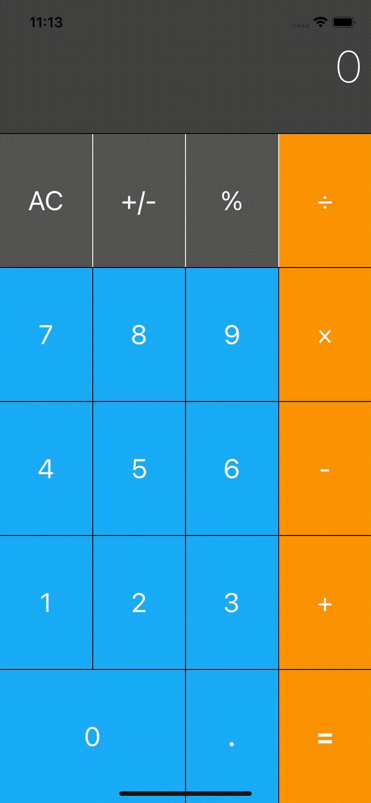

This is a simple calculator app built based on iOS tutotial.

Technologies Involved:

- **Computed Property**: Instead of constantly converting text shown on the calculator to numbers everytime we do a calcualtion, we defined a computed property called `displayValue` with getter and setter automatically doing the converstion bewteen string and number
- **Struct**:  Opted to use `struct` instead of `class` when creating data model `CalculatorLogic` since we do not intent for it to subclass anything or connect with objective-c code. Apple Documentation suggest to used struct by default (https://developer.apple.com/documentation/swift/choosing_between_structures_and_classes).